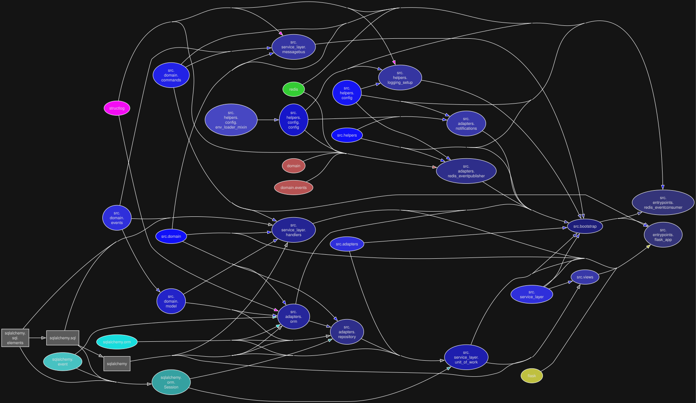
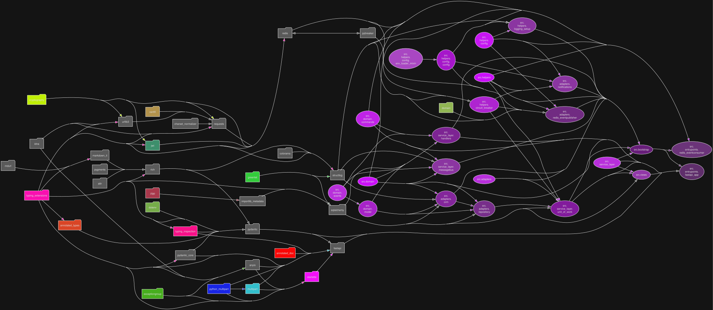

# EDA template - Python

### Project structure diagrams

##### Modular perspective

<p align="center">
  
</p>

##### Library dependencies perspective

<p align="center">
  
</p>


## Fast native Windows development

```commandline
deactivate ; 
clear; 

docker system df ; 
docker compose down -v --remove-orphans ; 
docker stop $(docker ps -a -q) ; 
docker rm -f $(docker ps -a -q) ; 
docker system prune --volumes -a -f ; 
docker volume rm -f $(docker volume ls -q) ; 
docker system df ; 

$ports = 5005, 54321, 6378, 11025, 18025, 5433

foreach ($port in $ports) {
    $conns = Get-NetTCPConnection -LocalPort $port -ErrorAction SilentlyContinue
    if ($conns) {
        $conns | Select-Object -ExpandProperty OwningProcess -Unique |
            Where-Object { $_ -gt 0 } |
            ForEach-Object {
                Write-Host "Port $port is used by PID $_. Killing..."
                Stop-Process -Id $_ -Force -ErrorAction SilentlyContinue
            }
    } else {
        Write-Host "No process is using port $port."
    }
}

uv self update ; 
uv cache clean ; 

git reset --hard HEAD ; 
git clean -x -d -f ; 

#####

uv python install 3.14 ; 
uv python pin 3.14 ; 
uv sync --dev --no-cache ; 
uv lock ; 

########## STATIC ANALYSIS & TESTS

.venv\Scripts\Activate.ps1 ; 
$env:UV_ENV_FILE = ".dev.env" ; 

.\scripts\format_and_lint.ps1 ; 

docker-compose down --remove-orphans ; 
docker-compose build ; 
docker-compose up -d ; 
docker-compose run --rm --no-deps --entrypoint=pytest api /tests ; 
docker-compose logs --tail=25 api redis_pubsub ; 

docker-compose down --remove-orphans ; 
docker-compose build ; 
docker-compose up -d ; 
uv run pytest tests/ --cov=src --cov-report=html --cov-report=xml --cov-config=.coveragerc -vv ; 
docker-compose logs --tail=25 api redis_pubsub ; 
Start-Process .\htmlcov\index.html ; 
```

## Full static analysis

Login in SonarQube as `admin` with password `Admin1@Admin1@`.

```commandline
deactivate ; 
clear; 

docker system df ; 
docker compose down -v --remove-orphans ; 
docker stop $(docker ps -a -q) ; 
docker rm -f $(docker ps -a -q) ; 
docker system prune --volumes -a -f ; 
docker volume rm -f $(docker volume ls -q) ; 
docker system df ; 

$ports = 5005, 54321, 6378, 11025, 18025, 5433

foreach ($port in $ports) {
    $conns = Get-NetTCPConnection -LocalPort $port -ErrorAction SilentlyContinue
    if ($conns) {
        $conns | Select-Object -ExpandProperty OwningProcess -Unique |
            Where-Object { $_ -gt 0 } |
            ForEach-Object {
                Write-Host "Port $port is used by PID $_. Killing..."
                Stop-Process -Id $_ -Force -ErrorAction SilentlyContinue
            }
    } else {
        Write-Host "No process is using port $port."
    }
}

uv self update ; 
uv cache clean ; 

git reset --hard HEAD ; 
git clean -x -d -f ; 

#####

uv python install 3.14 ; 
uv python pin 3.14 ; 
uv sync --dev --no-cache ; 
uv lock ; 

########## STATIC ANALYSIS & TESTS

.venv\Scripts\Activate.ps1 ; 
$env:UV_ENV_FILE = ".dev.env" ; 

.\scripts\format_and_lint.ps1 ; 

docker-compose down --remove-orphans ; 
docker-compose build ; 
docker-compose up -d ; 
docker-compose run --rm --no-deps --entrypoint=pytest api /tests ; 
uv run pytest tests/ --cov=src --cov-report=html --cov-report=xml --cov-config=.coveragerc -vv ; 
Start-Process .\htmlcov\index.html ; 

########## SONARQUBE

docker compose up -d sonarqube sonardb ; 

do {
    Start-Sleep -Seconds 5

    try {
        $status = Invoke-RestMethod `
            -Uri "http://127.0.0.1:9000/api/system/status" `
            -Method Get
    }
    catch {
        $status = $null
    }

} until ($status.status -eq "UP")

$oldPassword = "admin"
$newPassword = "Admin1@Admin1@"

$pair = "admin:$oldPassword"
$encoded = [Convert]::ToBase64String(
    [Text.Encoding]::ASCII.GetBytes($pair)
)

$headers = @{
    Authorization = "Basic $encoded"
}

Invoke-RestMethod `
    -Uri "http://127.0.0.1:9000/api/users/change_password" `
    -Method Post `
    -Headers $headers `
    -Body @{
        login = "admin"
        previousPassword = $oldPassword
        password = $newPassword
    }

$newPair = "admin:$newPassword"
$newEncoded = [Convert]::ToBase64String(
    [Text.Encoding]::ASCII.GetBytes($newPair)
)

$newHeaders = @{
    Authorization = "Basic $newEncoded"
}

# Generate token
$tokenName = "global-analysis-token"

$tokenResponse = Invoke-RestMethod `
    -Uri "http://127.0.0.1:9000/api/user_tokens/generate" `
    -Method Post `
    -Headers $newHeaders `
    -Body @{
        name = $tokenName
        type = "GLOBAL_ANALYSIS_TOKEN"
    }

$token = $tokenResponse.token

@"
SONAR_HOST_URL=http://sonarqube:9000
SONAR_TOKEN=$token
"@ | Out-File -Encoding utf8 ".sonar.env"

$scannerOutput = docker run --rm `
    --network sonar-network `
    --env-file .sonar.env `
    -v "${PWD}:/usr/src" `
    -w /usr/src `
    sonarsource/sonar-scanner-cli 2>&1

$scannerOutput

$reportUrls = ($scannerOutput |
    Select-String "http://\S+") |
    ForEach-Object { $_.Matches.Value }

foreach ($url in $reportUrls) {
    $localUrl = $url `
        -replace "http://sonarqube:9000", "http://127.0.0.1:9000" `
        -replace "http://host.docker.internal:9000", "http://127.0.0.1:9000"

    Start-Process $localUrl
}

########## UPDATE DIAGRAMS

uv run pydeps src\allocation\entrypoints\flask_app.py --noshow -T svg -o images\structure_runner_clustered.svg --max-bacon 100 --max-module-depth 100 --rankdir LR --cluster ; 
uv run pydeps src\allocation\entrypoints\flask_app.py --noshow -T svg -o images\structure_runner.svg --max-bacon 2 --max-module-depth 100 --rankdir LR ; 
uv run pydeps src\allocation\entrypoints\flask_app.py --noshow -T svg -o images\structure_runner_pylib.svg --max-bacon 2 --max-module-depth 100 --rankdir LR --pylib ; 

uv run pydeps src --noshow -T svg -o images\structure_module_clustered.svg --max-bacon 100 --max-module-depth 100 --rankdir LR --cluster ; 
uv run pydeps src --noshow -T svg -o images\structure_module.svg --max-bacon 2 --max-module-depth 100 --rankdir LR ; 
uv run pydeps src --noshow -T svg -o images\structure_module_pylib.svg --max-bacon 2 --max-module-depth 100 --rankdir LR --pylib ; 

uv run pydeps tests --noshow -T svg -o images\structure_tests_module_clustered.svg --max-bacon 100 --max-module-depth 100 --rankdir LR --cluster ; 
uv run pydeps tests --noshow -T svg -o images\structure_tests_module.svg --max-bacon 2 --max-module-depth 100 --rankdir LR ; 
uv run pydeps tests --noshow -T svg -o images\structure_tests_module_pylib.svg --max-bacon 2 --max-module-depth 100 --rankdir LR --pylib ; 

$files = Get-ChildItem "images" -Filter "*.svg"

foreach ($file in $files) {
    $svg = Get-Content $file.FullName -Raw
    $svg = $svg -replace '<polygon fill="white"', '<polygon fill="#141414"'
    $svg = $svg -replace '<svg', '<svg style="background-color:#141414"'
    $svg = $svg -replace 'fill="blue"', 'fill="#5a5a5a"'
    $svg = $svg -replace 'fill="#ffffff"', 'fill="#2e2e2e"'
    $svg = $svg -replace 'stroke="black"', 'stroke="#ffffff"'
    $svg = $svg -replace 'stroke="#000000"', 'stroke="#5f5f5f"'
    $svg = $svg -replace '<text([^>]*)fill="[^"]+"', '<text$1fill="#e0e0e0"'
    $svg = $svg -replace '<g class="cluster">', '<g class="cluster" style="opacity:0.85"'

    Set-Content -Path $file.FullName -Value $svg -Encoding UTF8
    Write-Host "Structure preserved: $($file.Name)"
}
```

### Fast local refactor

```
clear ; .\scripts\format_and_lint.ps1 ; uv run pytest tests/ --cov=src --cov-report=html --cov-report=xml -vv ; Start-Process .\htmlcov\index.html ; 
```